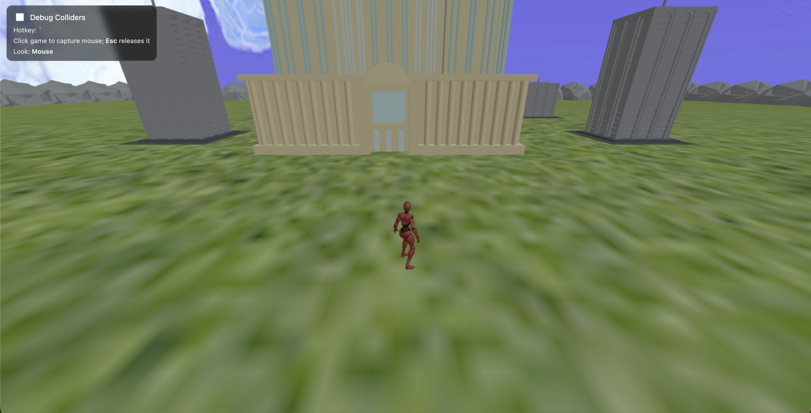

# 3D Web Game Template

This repository is a template for building a browser-based 3D game with [Three.js](https://threejs.org/) for rendering and [Ammo.js](https://github.com/kripken/ammo.js/) for physics. A small Flask application serves the HTML templates and the local JavaScript, WebAssembly, models, textures, and animations used by the game.

## Running the app

Run the launcher from the project root:

```bash
./launch.sh
```

If the script is not executable, either grant it execute permission with `chmod +x launch.sh` or run it with `bash launch.sh`.

The launcher expects the following to already be available:

- Python 3
- A Python virtual environment directly inside the project directory
- `requirements.txt` and `main.py` in the current directory

If a virtual environment has not yet been created, create one and then rerun the launcher:

```bash
python3 -m venv .venv
./launch.sh
```

Once Flask starts, open [http://localhost:8080](http://localhost:8080). The landing page links to the game at [http://localhost:8080/basic_game](http://localhost:8080/basic_game).

Once you launch the Flask app and click the **Play Game** button, you will launch the game shown below.



## How `launch.sh` works

`launch.sh` is a Bash startup wrapper for the Flask application. It performs the following steps:

1. `set -Eeuo pipefail` enables strict error handling so the script stops when a command fails, an unset variable is used, or a pipeline fails.
2. The script treats the current working directory as the project directory. For that reason, it should be invoked from the repository root.
3. It verifies that `requirements.txt` and `main.py` exist.
4. It searches for a valid virtual environment, preferring `.venv`, `venv`, and then `env`. If none of those is valid, it checks other immediate child directories for `pyvenv.cfg` and an executable `bin/python`.
5. It runs the selected environment's Python interpreter with:

   ```bash
   python -m pip install --requirement requirements.txt
   ```

   Pip leaves already-satisfied packages alone and installs or updates packages that do not satisfy the requirement specifiers.
6. It starts the application with the virtual environment's interpreter. The final `exec` replaces the Bash process with the Python process, so signals and the terminal session are handled directly by Flask:

   ```bash
   exec <virtual-environment>/bin/python main.py
   ```

### The Flask application

`main.py` creates the Flask application and defines two routes:

- `/` renders `templates/index.html`, the landing page.
- `/basic_game` renders `templates/basic_game.html`, the Three.js/Ammo.js game.

Both routes accept `GET` and `POST`, although they currently render the same template for either method. When `main.py` is run directly, Flask's development server listens on all interfaces at port `8080` with debug mode enabled.

The application also registers `.wasm` files with the `application/wasm` MIME type. This lets the browser load Ammo.js's WebAssembly binary correctly. Flask automatically exposes files under the project's `static/` directory at URLs beginning with `/static/`.

> The built-in debug server is intended for local development, not production deployment.

## How `basic_game.html` works

`templates/basic_game.html` contains the game page, its minimal full-screen styling, and the main JavaScript module. Its startup sequence is:

1. Load the Ammo.js bootstrap script from `/static/js/ammo/ammo.wasm.js`.
2. Define a browser import map for the local Three.js module.
3. Import Three.js and the `FBXLoader`, `MTLLoader`, and `OBJLoader` helpers from `static/js/three/`.
4. Call `init()`, which waits for `Ammo()` to initialize the WebAssembly physics engine.
5. Create the Three.js scene, perspective camera, WebGL renderer, lights, sky, and textured ground.
6. Create the Ammo.js dynamics world, gravity, ground collider, environment rigid bodies, and player capsule.
7. Load the player's FBX model animations and the environment's OBJ/MTL models.
8. Bind keyboard, mouse, resize, and debug controls, then begin the animation loop.

The `update()` loop runs once per animation frame. It advances the Ammo.js simulation, checks player contacts, handles movement and jumping, applies wall and slope forces, copies physics transforms to Three.js objects, updates FBX animation state, follows the player with the camera, and renders the scene.

### Controls

- `WASD` or arrow keys: move
- Left or right `Shift`: sprint while moving forward
- `Space`: jump
- Mouse: turn the player and pitch the camera after clicking the game canvas
- `Escape`: release the captured mouse
- Backtick (`` ` ``): toggle collider debug visuals

### Static resources

Flask maps a request such as `/static/textures/grass.jpg` to `static/textures/grass.jpg` in the repository. `basic_game.html` uses root-relative `/static/...` URLs so every asset is requested from Flask regardless of whether the current page is `/basic_game` or another route.

The game loads these resource groups:

| Directory | Purpose |
| --- | --- |
| `static/js/ammo/` | Ammo.js loader and WebAssembly physics binary |
| `static/js/three/` | Three.js module and model loaders |
| `static/player_fbx/` | Player model animations for idle, movement, strafing, jumping, and falling |
| `static/models/` | OBJ geometry and MTL material files for crates, rocks, and skyscrapers |
| `static/textures/` | Sky and ground images |

For example, this template constant:

```javascript
const PLAYER_FBX_IDLE = '/static/player_fbx/idle.fbx';
```

causes the browser to request `/static/player_fbx/idle.fbx`; Flask resolves that URL to `static/player_fbx/idle.fbx`. The texture and OBJ/MTL loaders work the same way. Because those files are fetched over HTTP and the JavaScript uses ES modules and WebAssembly, the game should be opened through the Flask server instead of by opening `basic_game.html` directly from the filesystem.

## Project structure

```text
.
├── launch.sh
├── main.py
├── requirements.txt
├── templates/
│   ├── index.html
│   └── basic_game.html
└── static/
    ├── js/
    ├── models/
    ├── player_fbx/
    └── textures/
```
